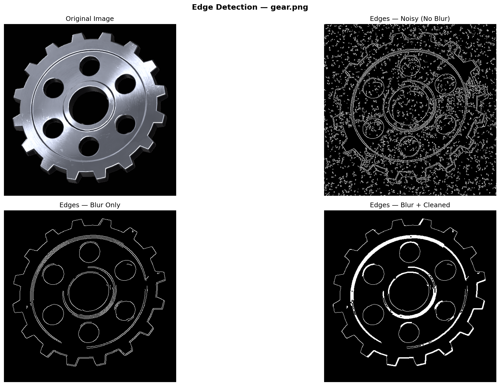

# Industrial Edge Detection Pipeline

A drag-and-drop desktop application for detecting structural boundaries in industrial component images. Demonstrates the progressive effect of preprocessing on edge detection quality — from raw noisy input to clean morphologically-processed output.


---

## Preview



---

## What It Does

Drop any image onto the application window and it runs a full edge detection pipeline, producing a 2×2 comparison plot showing each stage of processing:

| Panel | Description |
|-------|-------------|
| Original Image | Source image as loaded |
| Edges — Noisy | Canny applied directly on noise-injected grayscale (worst case) |
| Edges — Blur Only | Canny after Gaussian blur preprocessing |
| Edges — Blur + Cleaned | Canny after blur, then morphological closing (best case) |

Each output is automatically saved to the `outputs/` folder with timestamps.

---

## Pipeline

```
Input Image
    │
    ├─ BGR → RGB             (for display)
    │
    └─ BGR → Grayscale
            │
            ├─ + Gaussian Noise (σ=25)     ← simulates real sensor noise
            │       │
            │       └─ Canny ──────────────► Edges (Noisy)
            │
            └─ Gaussian Blur (5×5)
                    │
                    ├─ Canny ──────────────► Edges (Blur Only)
                    │
                    └─ Morphological Close ► Edges (Blur + Cleaned)
```

### Why Each Step Exists

**Gaussian Noise injection** simulates real-world sensor conditions — industrial cameras and encoders always have some level of electrical noise. Without it, the comparison between filtered and unfiltered would be misleading.

**Gaussian Blur** smooths out high-frequency noise before edge detection. Canny's gradient computation is highly sensitive to noise; blur prevents false edges from being detected.

**Morphological Closing** (`MORPH_CLOSE`) dilates then erodes the edge map, connecting nearby broken edge segments into continuous contours — critical for downstream tasks like contour tracing or defect detection.

---

## Parameters

Tunable at the top of the script:

```python
LOW_THRESHOLD  = 100   # Canny lower hysteresis threshold
HIGH_THRESHOLD = 200   # Canny upper hysteresis threshold
```

The ratio of `HIGH / LOW = 2:1` follows the commonly recommended Canny guideline. Lowering both thresholds detects more edges (including weak ones); raising them keeps only strong, well-defined boundaries.

---

## Requirements

```
opencv-python
matplotlib
numpy
tkinterdnd2
```

Install with:

```bash
pip install -r requirements.txt
```

> **Note:** `tkinterdnd2` provides drag-and-drop support for Tkinter. On some Linux systems you may need to install `python3-tk` via your package manager before running.

---

## Usage

```bash
python edge_detection.py
```

A dark-themed window will open. Drag and drop any supported image file onto it — the pipeline runs automatically and the result plot appears immediately.

**Supported formats:** `.jpg` `.jpeg` `.png` `.bmp` `.tiff`

Output images are saved to:
```
outputs/<original_filename>_<YYYYMMDD_HHMMSS>.png
```

---

## Project Structure

```
edge-detection/
├── images/                        # input images
│   ├── circuit_board.png
│   ├── circuit.jpg
│   ├── gear.png
│   └── machine_parts.jpeg
├── outputs/                       # auto-generated, timestamped result images
│   ├── circuit_20260610_233....png
│   ├── circuit_board_20260610_...png
│   ├── gear_20260610_2337....png
│   ├── gear_20260610_2342....png
│   └── machine_parts_2026....png
├── venv/                          # virtual environment (not tracked by git)
├── .gitignore
├── edge_detection.py              # main pipeline and GUI
├── README.md
└── requirements.txt
```

---

## Author

**Siddharth Kar**

---